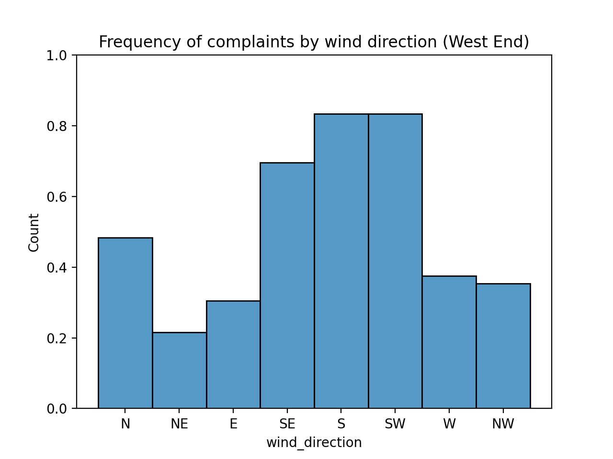
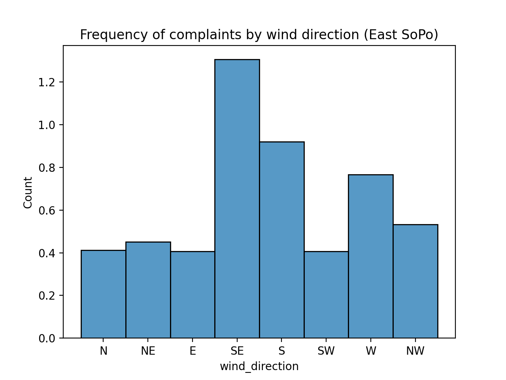
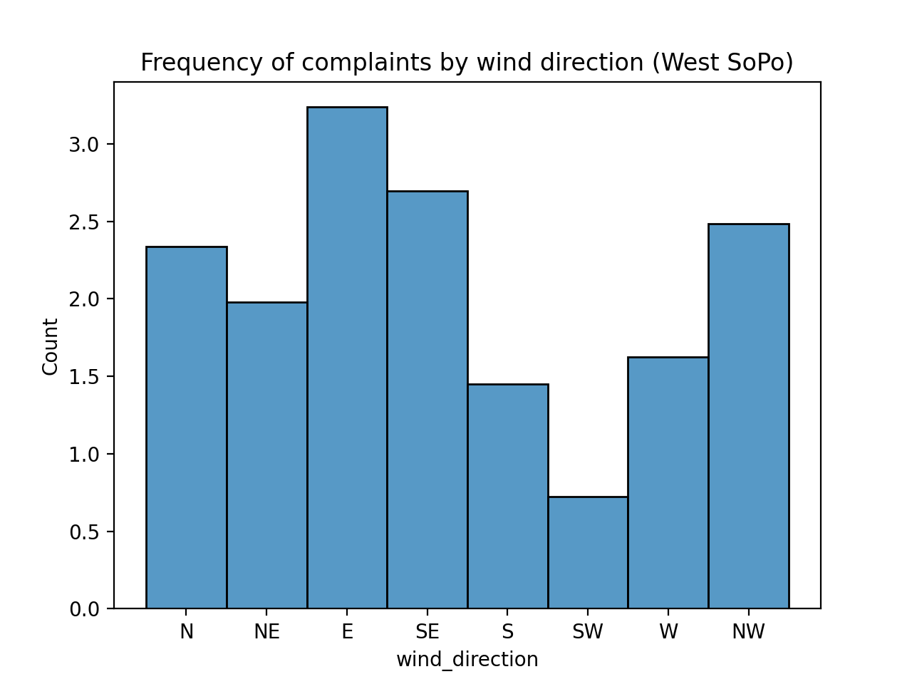

# stinky2
Turning stinky into a production site

## Local development

Install requirements via `pip3 install -r requirements.txt`.

To run the website, navigate to `/website` and run `run_site.py`.

To get, merge, and do analysis on the data, the following commands work:

- `make get_data` retrieves weather and complaint data from APIs
- `make merge_data` merges weather and complaint data together to prepare for analysis
- `make scatterplots` creates scatterplots using weather and complaint data
- `make histograms` creates histograms using weather and complaint data
- `make regression` performs regression modeling using weather and complaint data

## Generating data

To create CSV files for smell complaints and weather, run `get_smc_data.py` and `get_weather_data.py`.

Retrieving weather data requires an [API token](https://www.ncdc.noaa.gov/cdo-web/token). 

## EDA results

In general, as temperature rises, the number of complaints per day rises as well, reaching a peak around 70 degrees.

In general, average wind speed and the number of complains per day appears somewhat correlated; most complaints appear to happen on days where the wind averages around 3 m/s.

In eastern South Portland, the most complaints happen when the wind blows (strongest wind in a 5-minute period) from the South. Complaints are also frequent when the wind blows from the Southeast, West, and Northwest.

In western South Portland, the most complaints happen when the wind blows from the Northwest, with a large number of complaints when the wind blows in every direction except from the Southwest and Northeast. This may happen because western South Portland residential neighborhoods reside alongside oil tank farms.

In the West End of Portland (zip codes in 04101 and 04102), the majority of complaints happen when the wind blows from the South (where most of the tank farms in South Portland reside).

The wind blows mostly from the South, Northwest, West, and North (in order of frequency), but complaints from the West End happen much more frequently when wind blows from the South.

Accounting for the frequency of wind directions removes bias from the data set and shows that, for the West End, complaints happen far more frequently when the wind blows from a southerly direction.

In each neighborhood, most complaints happen when the average temperature is between 60 and 75 degrees Fahrenheit. There are also some temperatures outside of this range that coincided with a high number of complaints.