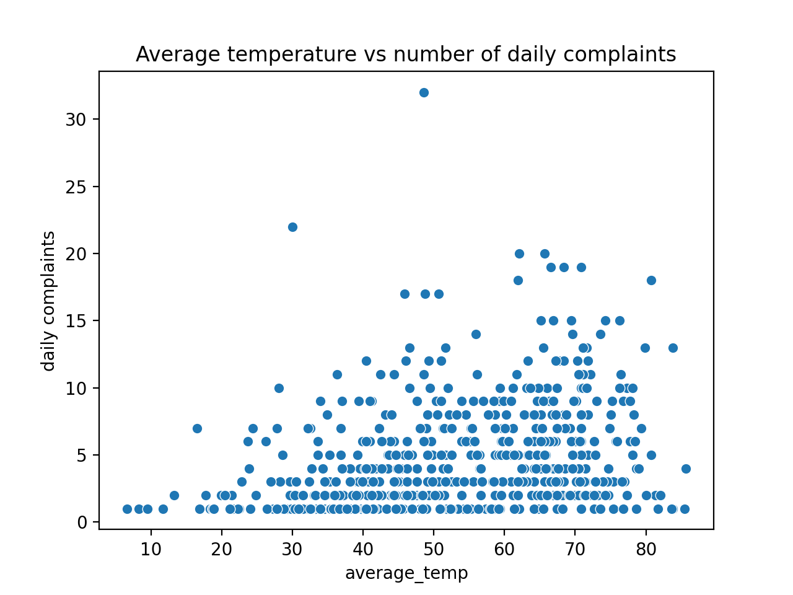
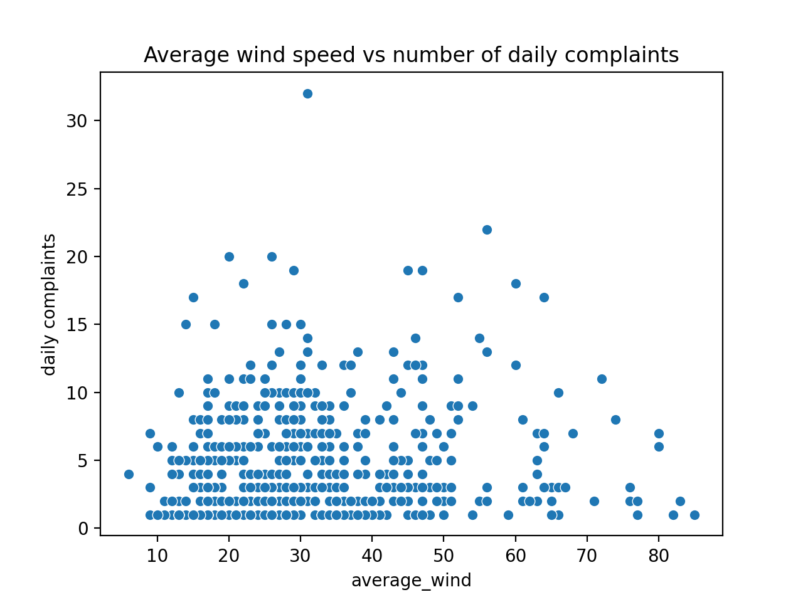
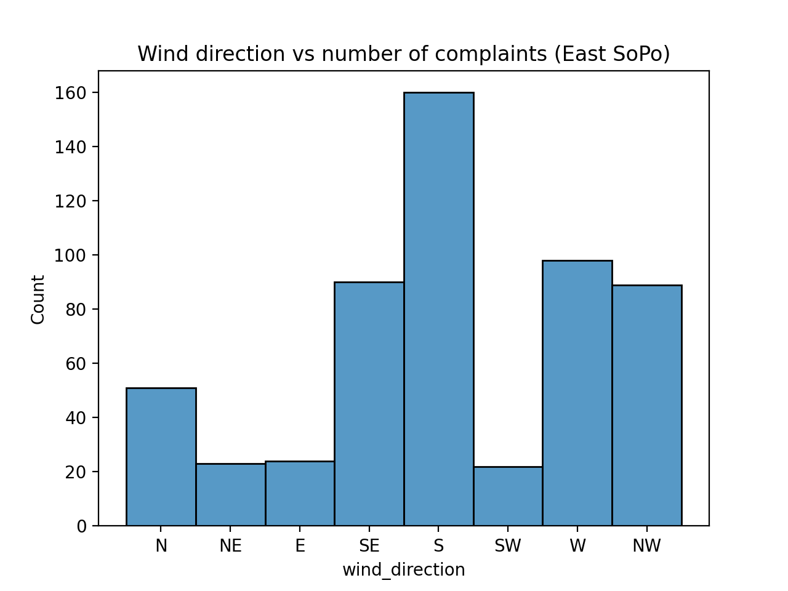
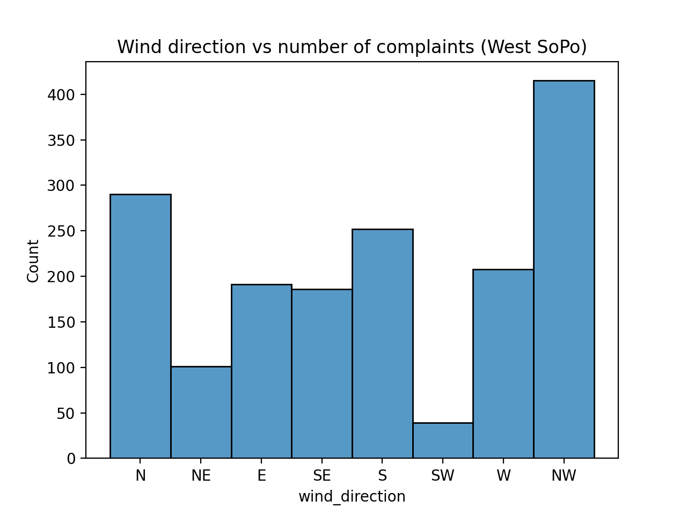
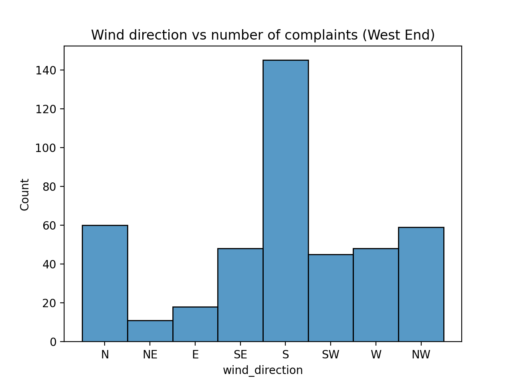
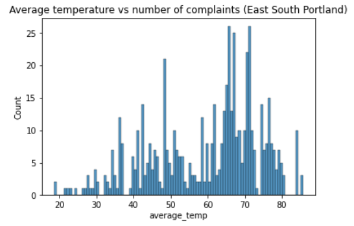
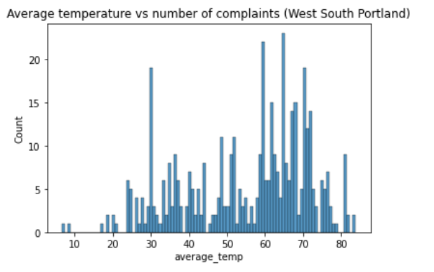
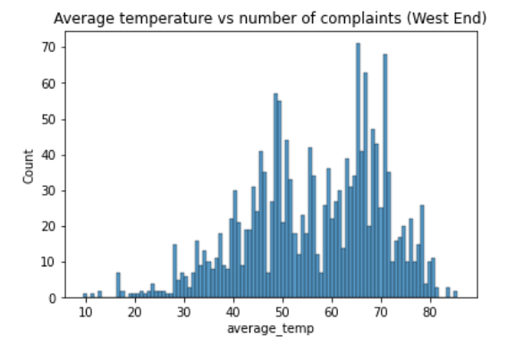

# stinky2
Turning stinky into a production site

## Local development

Install requirements via `pip3 install -r requirements.txt`.

To run the website, navigate to `/website` and run `run_site.py`.

To get, merge, and do analysis on the data, the following commands work:

- `make get_data` retrieves weather and complaint data from APIs
- `make merge_data` merges weather and complaint data together to prepare for analysis
- `make scatterplot` creates scatterplots using weather and complaint data
- `make histogram` creates histograms using weather and complaint data
- `make regression` performs regression modeling using weather and complaint data

## Generating data

To create CSV files for smell complaints and weather, run `get_smc_data.py` and `get_weather_data.py`.

Retrieving weather data requires an [API token](https://www.ncdc.noaa.gov/cdo-web/token). 

## EDA results

